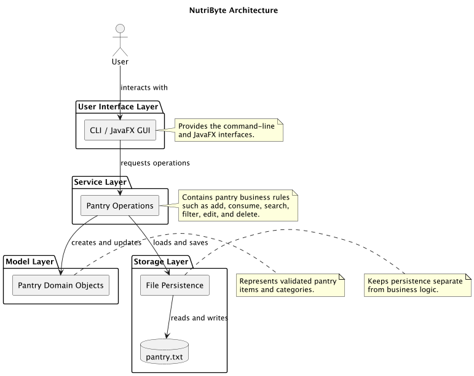

# Developer Guide

## Contents

1. [Design & implementation](#design--implementation)
   1. [Design](#design)
   2. [Architecture](#architecture)
   3. [Components](#components)
   4. [Implementation](#implementation)
2. [Testing and development process](#testing-and-development-process)
3. [Acknowledgements](#acknowledgements)

---

## Design & implementation

### Design

NutriByte follows a small layered design. The UI handles input and presentation, the service owns pantry business rules, the model represents validated pantry data, and storage handles files. This keeps the core operations independent of JavaFX and console details.

### Architecture

The editable PlantUML source for this diagram is [`Architecture.puml`](Architecture.puml).



The main execution paths are:

* The CLI reads a line, parses it, validates its arguments, calls `PantryService`, prints a result, and saves through `PantryStorage`.
* The JavaFX GUI sends commands through `GuiCliBridge` to reuse the CLI behavior, while `PantryDisplayProvider` loads and filters data for the pantry list.

The architecture can be summarised in four main points:

* **User Interface:** accepts user commands and displays pantry information through the CLI or JavaFX GUI.
* **Service:** applies all pantry rules, including quantity changes, validation, searching, filtering, editing, and deletion.
* **Model:** represents valid pantry items and categories; `PantryItem` is immutable so state cannot be changed unexpectedly.
* **Storage:** loads and saves pantry data in a text file, keeping file handling separate from the user interface and business logic.

---
### Components

#### User interface component

API: `NutriByteGui.java`, `NutriByte.java`, `Parser.java`, `CommandValidator.java`, and `Ui.java`

* `NutriByteGui` builds the JavaFX layout, handles button/input events, and renders messages and pantry items.
* `NutriByte` owns the CLI lifecycle, command dispatch, save triggers, and user-facing error messages.
* `Parser` converts one line into a command and arguments. Text in double quotes remains one argument, allowing names such as `"Fresh Milk"`.
* `CommandValidator` checks the expected shape of command arguments.
* `Ui` formats greetings, help text, and item lists.

The UI does not implement quantity, date, or category rules itself; it delegates those rules to the service.


#### Service component

API: `PantryService.java` and `PantryOperationResult.java`

`PantryService` manages items in insertion order and provides add, consume, restock, delete, edit, search, and filter operations. It uses one-based indexes at its public boundary because those are the indexes shown to users. Expected failures return `PantryOperationResult` values such as `INVALID_INDEX`, `INVALID_VALUE`, `AMBIGUOUS_ITEM`, and `INSUFFICIENT_STOCK`.


#### Model component

API: `PantryItem.java` and `Category.java`

`PantryItem` is an immutable, final value object. Its private final fields are validated at construction. Updates create replacement items using `withName`, `withQuantity`, `withCategory`, `withExpiryDate`, or `withQuantityChange`. `Category` is an enum containing the supported pantry categories.


#### Storage component

API: `PantryStorage.java`

`PantryStorage` is the only class responsible for pantry file I/O. It reads and writes UTF-8 tab-separated records, treats a missing file as an empty pantry, creates parent directories when saving, and rejects malformed records. The default path is `data/pantry.txt`; `nutribyte.dataFile` can override it.


#### GUI display and bridge components

API: `PantryDisplayProvider.java` and `GuiCliBridge.java`

`PantryDisplayProvider` loads items and applies all/search/category/expiry views while preserving each item's original index. `GuiCliBridge` runs the existing CLI on a daemon thread, connects it to piped streams, forwards complete UTF-8 output lines to JavaFX, and restores the original process streams when the CLI ends or the window closes.


---
### Implementation

#### Add and inventory feature

**Overview**

The add feature creates a validated `PantryItem` and appends it to `PantryService`. The user can provide a name, positive quantity, optional category, and optional ISO expiry date. `list` reads the service's unmodifiable item view and displays one-based indexes.

**Process**

1. The user enters `add "Fresh Milk" 2 dairy`.
2. `Parser` produces the `ADD` command and three arguments.
3. The CLI validates the quantity/category/date shape and calls `PantryService.addItem()`.
4. `PantryItem` validates the name, quantity, and category.
5. `Ui` prints `Nice! Added Fresh Milk (2) to the pantry.` and the command loop saves the list.

#### Consume and restock feature

**Overview**

`consume` decreases stock and `restock` increases it. A unique name or a one-based index can select the item. The service checks positive quantities, index bounds, insufficient stock, ambiguous names, and integer overflow before replacing the immutable item.

**Example:** `consume index 1 1` is parsed and delegated to `PantryService.consumeItem(1, 1)`. A successful result is translated into a confirmation; an expected failure is translated into a specific message without throwing an exception.

#### Search and filter feature

**Overview**

`searchItems()` matches case-insensitively against names, category names, and ISO expiry dates. Category filtering and inclusive expiry-before/expiry-between filtering are implemented in `PantryService`. `PantryDisplayProvider` maps every returned item back to its original list index so filtered results remain actionable.

#### Edit and delete feature

**Overview**

`editItem()` validates an index and field, parses the replacement value, and replaces the item only after validation succeeds. Supported fields are `name`, `quantity`, `category`, and `expiry`; `none` clears an expiry date. `deleteItem()` validates the one-based index before removing the item. Both operations return an explicit result and are persisted by the command loop.

#### Persistence feature

**Overview**

At startup, `NutriByte` loads `data/pantry.txt` through `PantryStorage`. After each command and on exit, it saves the current list when loading succeeded. A missing or malformed file is handled without silently overwriting the original data; the user receives a clear message.


---
## Testing and development process

Tests are in `src/test/java` and use JUnit 5. They cover model invariants and formatting, service operations and boundaries, parser quoting and defensive copies, storage round trips and malformed records, CLI workflows, platform-independent line endings, GUI display indexes, and bridge lifecycle/stream restoration.

Run the complete verification suite with:

```shell
./gradlew test check
```

`check` includes Checkstyle. Tests use isolated input and temporary files rather than a developer's existing pantry data. For each change, update high-value tests, run the suite, and manually exercise a representative CLI or GUI workflow when user interaction is affected. Keep commits small and explain the reason for each change.

To run or package the current release with Java 25:

```shell
./gradlew run
./gradlew shadowJar
java -jar build/libs/nutribyte.jar
```

---
## Acknowledgements

I acknowledge:

* The provided Java/Gradle starter template and its source/test directory layout.
* The NUS CS3227 teaching team for the project guidance and documentation requirements.
* [JavaFX](https://openjfx.io/) for desktop UI controls.
* [Gradle](https://docs.gradle.org/current/userguide/userguide.html) for building, testing, Checkstyle, running, and packaging.
* [JUnit 5](https://junit.org/junit5/docs/current/user-guide/) for automated tests.
* [GitHub Flavored Markdown](https://guides.github.com/features/mastering-markdown/) for this documentation format.
* The SE-EDU Java coding and Git conventions supplied in `skills/seedu-java-coding-standard` and `skills/seedu-git-standard`.

The pantry domain model, command behavior, storage format, GUI composition, tests, and NutriByte-specific documentation were developed for this project. Any future copied code or text should be added here with its original author and source link.

